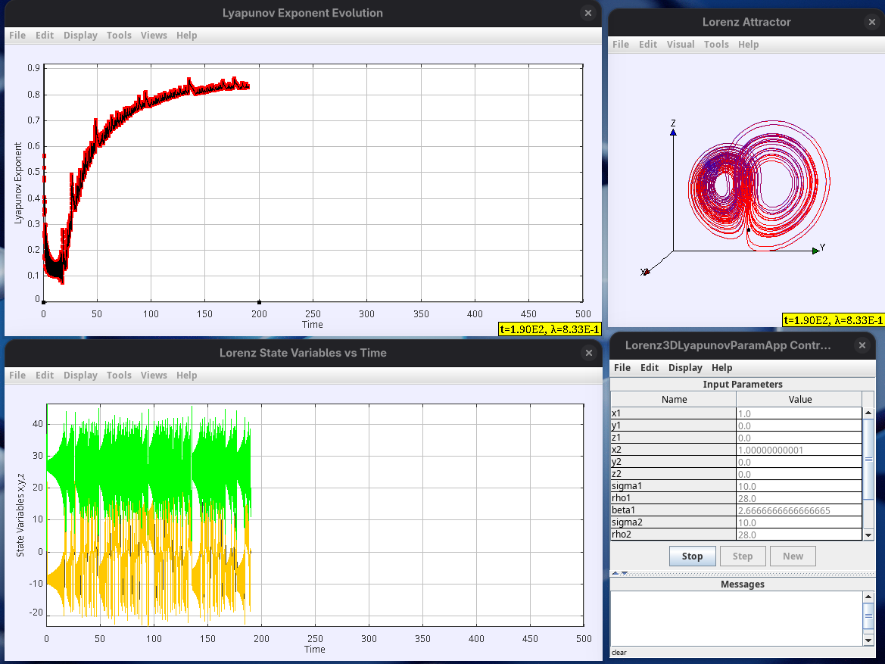
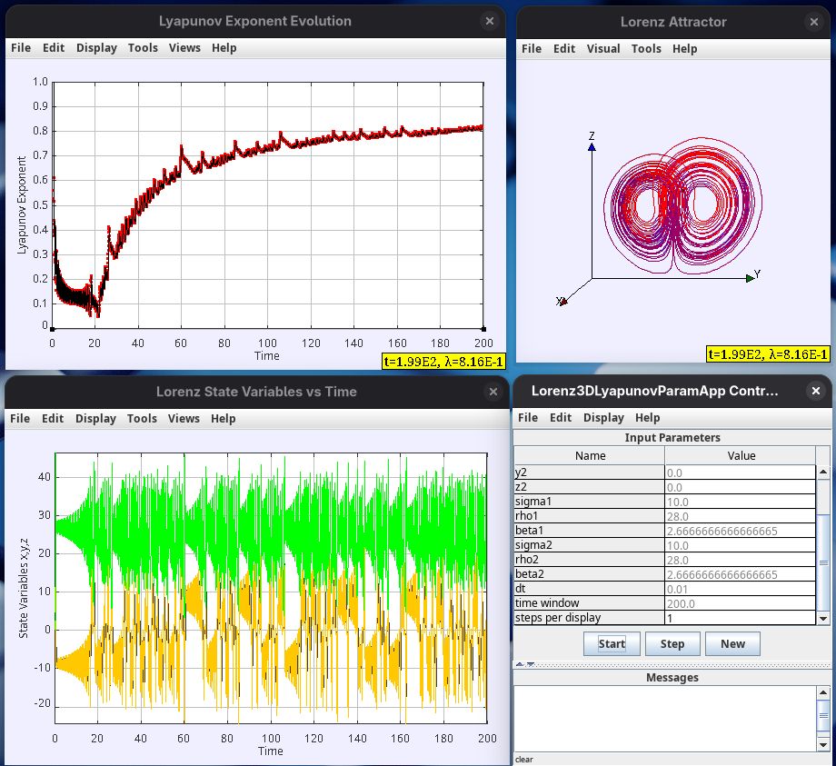
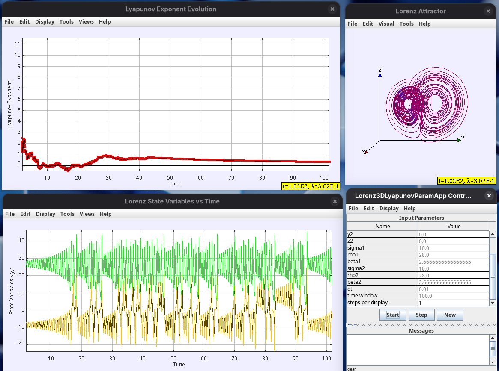
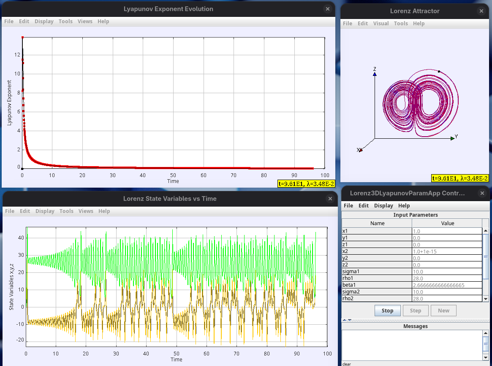
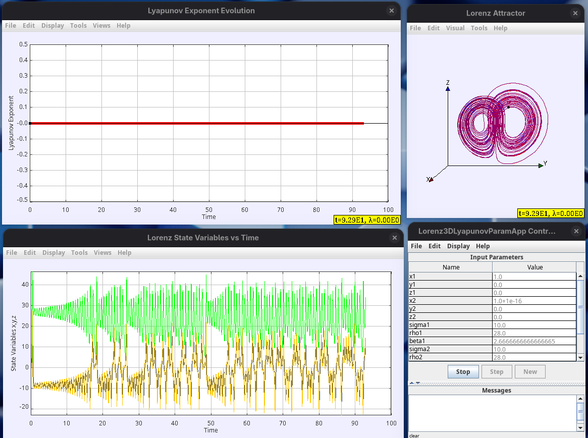

## Plots

I am trying to reproduce the experiment that was published here: https://www.linkedin.com/posts/activity-7332753927601360901-Fjp2?utm_source=share&utm_medium=member_desktop&rcm=ACoAAALDhKYB3smISZpSGggYikbgW7U86Ika1Ug.

One of the best articles I've found that scientifically proves that no "AI" or machine learning algorithm can perform reliable predictions in nonlinear chaotic systems.

We observe how an infinitesimal change on any of the inputs - either the state variables or parameters -, will cause an enormous disturbance on the output. This application would allow to change any of the state variables, or any parameters. 

Here is the link for a live demo:
https://alfonsorreyes.github.io/lorenz-lyapunov/

In this case, the app will start with a default value for x2 of 1+1e-9, small enough to reproduce the Lyapunov exponent of 0.9056, which should appearing between t=50 to t=100. Then, it can set as smaller as anyone wishes. Try with smaller values, for example, 1e-11, 1e-12, 1e-13. Smaller than 1-14, or 1e-15, will run but with no meaningful solution because of machine limitations.

## x = 1.0; LE = 0
The first plot is of two Lorenz sets running at a perturbation equal zero on state variables and parameters; the Lyapunov exponent will be around zero or zero. What I am trying to demonstrate is how an infinitesimal change in any of the inputs of Lorenz causes a big disturbance in its output. 

## x = 1.0+1e-9
This is still a small perturbation but still far from the machine epsilon. 

## x = 1.0+1e-12
This next plot shows that very small perturbation of the order of 1E-12 in the state variable "x" considerably affecting the output of the system. It is shown in the plot below where I plot the Lyapunov exponent (LE) vs time. It should converge to ~0.9056, as is in the literature at "t" between 50 to 100.

## x = 1.0+1e-13
We still observe chaotic behavior. LE~0.98.

## x =1.0+1e-14
Still chaotic but the LE curve starts degrading early.

## x=1.0+1e-15

## x=1.0+1e-16
Lorenz Loses its chaotic behavior. A change of 1-e16 is almost equivalent to setting the delta to zero, which makes no sense. The computer is not anymore catching deltas lower than 1e-15.

**A quick explanation of LE (λ)**

λ > 0 (Positive): chaotic behavior. Nearby trajectories diverge exponentially. Small uncertainties grow rapidly. Unpredictable, long-term behavior. Example: Weather systems, Lorenz attractor

λ = 0 (Zero): Marginal stability. trajectories neither converge nor diverge exponentially. Often found at bifurcation points. Quasi-periodic behavior.

λ < 0 (Negative): Stable behavior. Nearby trajectories converge.
Small perturbations decay over time. Predictable in the long-term behavior. Example: Damped oscillators, stable fixed points.

## References

* How chaotic is chaos? How some AI for Science / SciML papers are overstating accuracy claims. https://www.stochasticlifestyle.com/how-chaotic-is-chaos-how-some-ai-for-science-sciml-papers-are-overstating-accuracy-claims/

* Lyapunov exponent of the Lorenz system. https://www.chebfun.org/examples/ode-nonlin/LyapunovExponents.html

* Lyapunov Exponents from Random Fibonacci Sequences to the Lorenz Equations. https://ecommons.cornell.edu/items/82d8f293-1b91-40f9-a6f5-8070b3a70467

