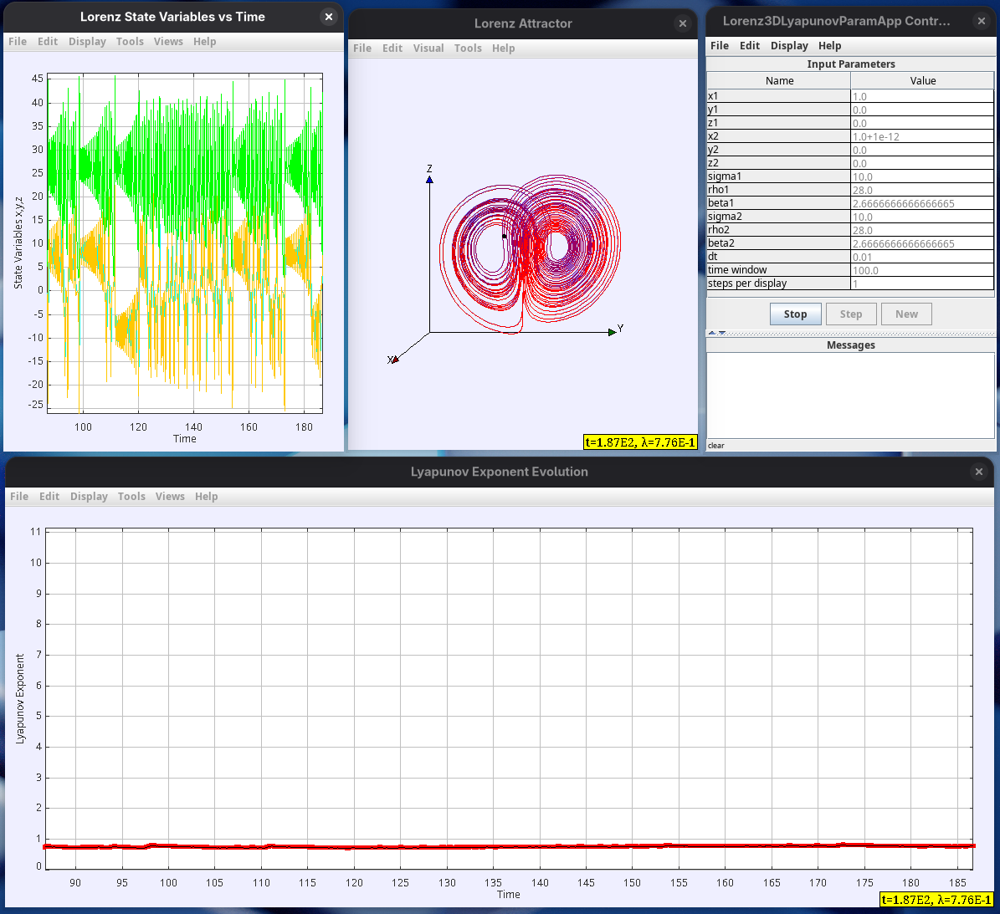

## Plots

I am trying to reproduce the experiment that was published here: https://www.linkedin.com/posts/activity-7332753927601360901-Fjp2?utm_source=share&utm_medium=member_desktop&rcm=ACoAAALDhKYB3smISZpSGggYikbgW7U86Ika1Ug.

One of the best articles I've found that scientifically proves that no "AI" or machine learning algorithm can perform reliable predictions in nonlinear chaotic systems.

## LE = 0
The first plot is of two Lorenz sets running at a perturbation equal zero on state variables and parameters; the Lyapunov exponent will be around zero or zero. What I am trying to demonstrate is how an infinitesimal change in any of the inputs of Lorenz causes a big disturbance in its output. 

## x = 1.0+1e-12
This next plot shows that very small perturbation of the order of 1E-12 in the state variable "x" considerably affecting the output of the system. It is shown in the plot below where I plot the Lyapunov exponent (LE) vs time. It should converge to ~0.9056, as is in the literature at "t" between 50 to 100.

## x = 1.0+1e-13
We still observe chaotic behavior. LE~0.98.

## x =1.0+1e-14
Still chaotic but the LE curve starts degrading early.

## x=1.0+1e-15

**A quick explanation of LE (λ)**

λ > 0 (Positive): chaotic behavior. Nearby trajectories diverge exponentially. Small uncertainties grow rapidly. Unpredictable, long-term behavior. Example: Weather systems, Lorenz attractor

λ = 0 (Zero): Marginal stability. trajectories neither converge nor diverge exponentially. Often found at bifurcation points. Quasi-periodic behavior.

λ < 0 (Negative): Stable behavior. Nearby trajectories converge.
Small perturbations decay over time. Predictable in the long-term behavior. Example: Damped oscillators, stable fixed points.